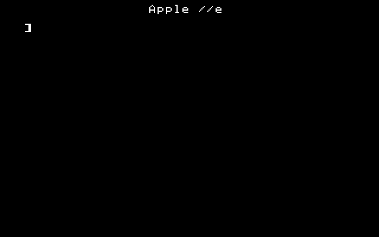
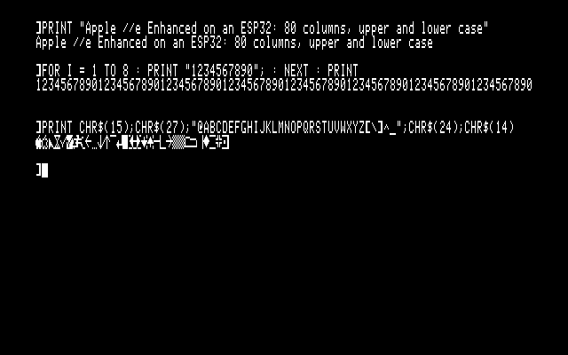
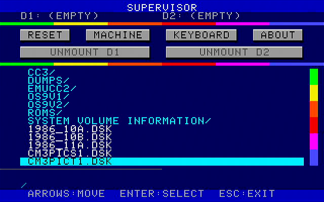
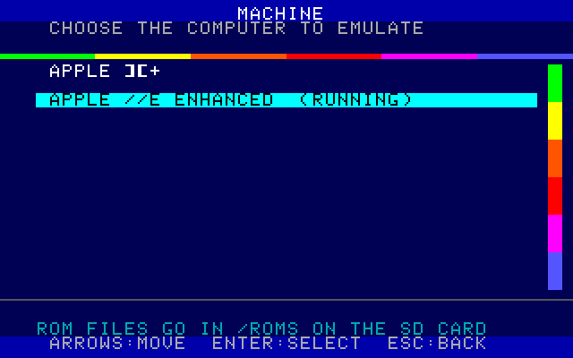
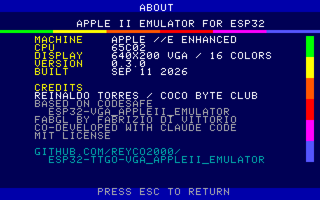
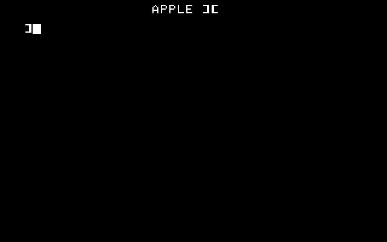
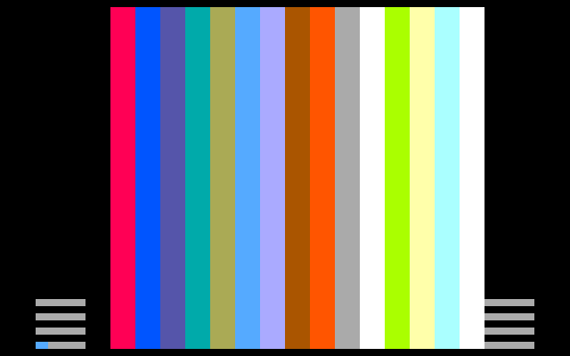
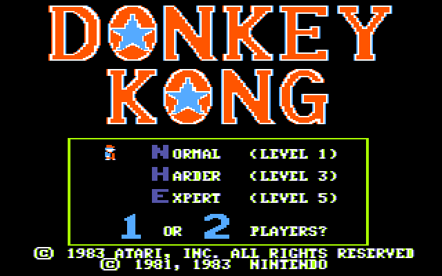
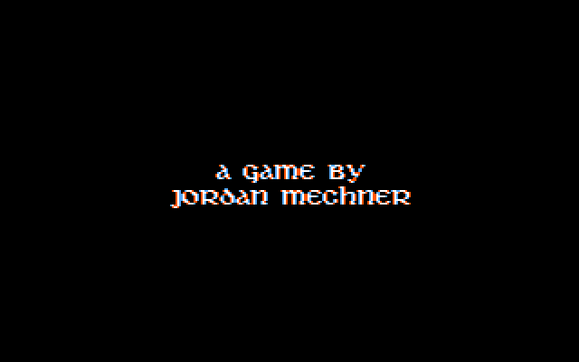
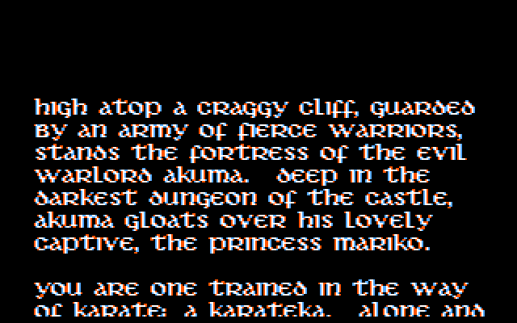

# ESP32-VGA Apple II Emulator

An Apple ][+ and Apple //e (enhanced) emulator that runs entirely on an ESP32 (LilyGO TTGO VGA32-class board), rendering to a VGA monitor via the [FabGL](https://github.com/fdivitto/FabGL) library. A PS/2 keyboard provides input, and `.dsk`, `.do`, `.po` and `.nib` floppy disk images are loaded from an SD card — no host computer involved.

## What's new in 0.8.0

- **Super Serial Card.** A 6551-based SSC can be put in slot 1 or slot 2 from the F1 menu's new **SERIAL** button. Its serial line is the board's USB port, so `PR#2` / `IN#2` talk to a terminal on the computer at the other end of the programming cable, and `PR#1` prints a listing to it. With **ALSO CAPTURE TO SD CARD** on, everything the Apple prints is written to `/printer/print-NNN.txt` as well. The card needs its firmware ROM on the SD card — see [Super Serial Card](#super-serial-card).
- While the card is installed the firmware's own serial log stops, so nothing of ours lands in the middle of the Apple's output.

## What's new in 0.7.0

- **Redesigned F1 supervisor menu.** The actions are now real buttons above the SD card browser: **RESET**, **MACHINE**, **KEYBOARD** and **ABOUT** on one row, **UNMOUNT D1** and **UNMOUNT D2** below them. They're drawn as raised buttons, and the focused one turns cyan. An unmount button for an empty drive is dimmed.
- **Arrow keys move in all four directions.** LEFT/RIGHT move along a row of buttons, and UP/DOWN move between the button rows and the file list. The status line shows what the focused button does, including the machine and keyboard layout in use.
- **Both drives share one line** at the top of the menu (`D1: ...  D2: ...`). Only the file name is shown, and a name too long for its half ends in `~`.
- The file list shows 12 entries at a time, up from 10, now that the actions are no longer rows in it.

## Screenshots

Pixel-exact captures, read back from the ESP32's framebuffer.

<table>
<tr>
<td width="50%"><br><sub>Apple //e (enhanced), cold start with no disk mounted.</sub></td>
<td width="50%"><br><sub>//e after <code>PR#3</code>: 80 columns, upper and lower case, and a line of MouseText.</sub></td>
</tr>
<tr>
<td width="50%"><br><sub><b>F1</b> supervisor: the buttons and the SD card browser, with both drives empty.</sub></td>
<td width="50%"><br><sub><b>MACHINE</b>: switch between the Apple ][+ and the Apple //e.</sub></td>
</tr>
<tr>
<td width="50%"><br><sub><b>ABOUT</b>: machine, CPU, firmware version and credits.</sub></td>
<td width="50%"><br><sub>Apple ][+, cold start — straight to the Applesoft prompt.</sub></td>
</tr>
<tr>
<td width="50%"><br><sub>The 16 lo-res colours, drawn by a four-line Applesoft program.</sub></td>
<td width="50%"><br><sub><i>Donkey Kong</i> title screen — hires mode.</sub></td>
</tr>
<tr>
<td width="50%"><br><sub><i>Karateka</i> booting on the //e.</sub></td>
<td width="50%"><br><sub><i>Karateka</i> story screen.</sub></td>
</tr>
</table>

## Features

- **Two machines**, switched from the F1 menu:
  - **Apple ][+** — NMOS 6502, 48K plus a 16K Language Card. Its ROMs are built into the firmware.
  - **Apple //e (enhanced)** — 65C02, 128K with the auxiliary 64K, 80-column text, lowercase and MouseText. Needs its ROM files on the SD card (see [ROM files](#rom-files)).
- 6502 and 65C02 CPU cores checked against Klaus Dormann's functional test suites, run on the build machine (`tests/host/run-cpu-tests.sh`)
- Text (40 and 80 columns), lores and hires, drawn on a 640×200 16-colour VGA picture using standard 640×480 @ 60 Hz timing (double hi-res is written but not yet verified — see TODO)
- **Two emulated Disk II drives** that take 140K sector images (`.dsk` / `.do` in DOS 3.3 order, `.po` in ProDOS order) and nibblized `.nib` images
- **Supervisor menu (F1)**: pauses emulation and opens a colour on-screen SD card browser — navigate subdirectories, mount/unmount disk images into Drive 1 or Drive 2, reset the machine, switch between the ][+ and the //e with **MACHINE**, pick the keyboard layout with **KEYBOARD**, put a Super Serial Card in a slot with **SERIAL**, or open **ABOUT** for the firmware version and credits. The arrow keys move between the buttons and the file list. Mounting never resets, so mid-game disk swaps work (multi-disk games like Ultima).
- **Joystick from a PS/2 mouse**: a mouse in the board's second PS/2 jack is the Apple II joystick — the two paddles (`PDL(0)`/`PDL(1)`) follow the mouse, and its left and right buttons are pushbuttons 0 and 1 (see [Joystick](#joystick))
- **Runs standalone or under [ESP32_Bootloader](https://github.com/ESP-WORKS/ESP32_Bootloader)**: flash it on its own over USB, or put it on the SD card as one entry in the bootloader's multi-emulator menu. Every release ships both builds (see [ESP32_Bootloader](#esp32_bootloader-sd-card-menu))
- **Super Serial Card** in slot 1 or 2, wired to the board's USB serial port: a terminal, a printer, or both at once with a capture file on the SD card (see [Super Serial Card](#super-serial-card))
- **FPS overlay (F2)**: toggles a live frames-per-second counter in the top right corner of the screen
- Boots to BASIC with no disk mounted; the Disk II boot PROM is only visible to the machine while a disk is mounted, so `PR#6` and the boot-time slot scan always behave

## Hardware Requirements

- **[LilyGo TTGO VGA32 v1.4](https://lilygo.cc/en-us/products/fabgl-vga32?_pos=1&_sid=4c095f59b&_ss=r)** (ESP32-WROVER-E, 4 MB PSRAM, 4 MB flash)
- **VGA monitor** capable of 640×480 @ 60 Hz (most VGA CRTs and adapters; some modern LCDs accept this mode, others won't sync)
- **PS/2 keyboard** plugged into the board's mini-DIN PS/2 jack
- **PS/2 mouse** (optional) in the second PS/2 jack — it is the Apple II joystick
- **MicroSD card** (FAT32 formatted) inserted in the on-board socket
- **3.5 mm audio output** (mono) on the board's jack
- **5 V USB-C** for power and serial programming

## Build & Flash

### Quick Flash (Pre-built Firmware)

If you just want to run the emulator without building from source, grab the pre-built firmware and use the browser-based flasher — no toolchain, no drivers to install beyond your board's USB-serial driver.

1. Download `ESP32-AppleII-v0.7.0.bin` from the [Releases](https://github.com/reyco2000/ESP32-TTGO-VGA_AppleII_Emulator/releases) page
2. Connect your TTGO VGA32 board via USB
3. Open [ESP Web Tool](https://espressif.github.io/esptool-js/) in a Chrome or Edge browser
4. Click **Connect** and select the board's serial port
5. Set the flash offset to `0x0000`
6. Choose the downloaded `ESP32-AppleII-v0.7.0.bin`
7. Click **Program** and wait for the flash to complete

Hold the **BOOT** button on the board while clicking **Connect** if the browser cannot reach the device.

That file is a complete image — bootloader, partition table, OTA selector and application merged together — so `0x0000` is the only offset you need. Verify the download against `SHA256SUMS` on the same release if you want to be sure it arrived intact.

> **Upgrading from 0.2.x:** 0.3.0 changes the flash partition layout. Flash the complete image at `0x0000` as above, not just the application image.

### Flash from the command line

Same binary, if you'd rather not use a browser:

```bash
esptool.py --chip esp32 --port /dev/ttyUSB0 --baud 921600 \
  write_flash 0x0 ESP32-AppleII-v0.7.0.bin
```

Depending on the board's USB-serial chip the port may enumerate as `/dev/ttyACM0` instead of `/dev/ttyUSB0`.

### ESP32_Bootloader (SD-card menu)

[ESP32_Bootloader](https://github.com/ESP-WORKS/ESP32_Bootloader) turns the board into an SD-card emulator loader. It is flashed once, and at power-up it shows a menu of every emulator on the card. This emulator can be one of them, next to other TTGO VGA32 emulators, without reflashing over USB.

Each release carries two builds. Use the one that matches how you run the board:

| You want | Release files | Install |
|---|---|---|
| Only this emulator, flashed over USB | `ESP32-AppleII-v0.7.0.bin` | at offset `0x0`, as above |
| This emulator in the ESP32_Bootloader menu | `firmware.bin` + `version.txt` | on the SD card, as below |

The two are not interchangeable: `firmware.bin` is built to hand the board back to the bootloader, and the standalone image is not.

**1. Install the bootloader (once).** Flash ESP32_Bootloader following [its own instructions](https://github.com/ESP-WORKS/ESP32_Bootloader). It replaces whatever was on the board, this emulator included.

**2. Put the emulator on the card.** Download `firmware.bin` and `version.txt` from the [release](https://github.com/reyco2000/ESP32-TTGO-VGA_AppleII_Emulator/releases), and put both in a folder named `AppleII` at the root of the card. Keep `/roms` and your disk images where they always are; the bootloader and the emulator share the card.

```
SD card root
├── AppleII/          <- the menu shows the folder name
│   ├── firmware.bin
│   └── version.txt
├── roms/             <- //e ROMs, as usual
├── Games/            <- your disk images, anywhere
└── <other emulators>/
```

If `firmware.bin` and `version.txt` sit in the card root instead of a folder, the bootloader skips the menu and always starts this emulator.

**3. Start it.** Power on, highlight **AppleII** with the arrow keys and press Enter. The first time, the bootloader shows its flashing progress and then the emulator boots. After that it starts right away.

**Everyday use**

- **Power cycle** to get back to the bootloader menu, and pick another emulator from there.
- **MACHINE** switches between the ][+ and the //e and restarts straight into the emulator, not the menu.
- **ABOUT** shows `0.7.0 (SD BOOTLOADER)` in this build, so you can tell which one is running.
- **Updating:** replace both files in `AppleII/` with the ones from the new release. The bootloader reflashes only when `version.txt` changes, so always copy both.
- **Settings** (machine, keyboard layout) are kept in the board's NVS, which the bootloader shares, so they carry over between sessions. They are lost if the whole flash is erased.

To build `firmware.bin` and `version.txt` yourself, see [Build from source](#build-from-source).

### Build from source

Built with [arduino-cli](https://arduino.github.io/arduino-cli/) — requires the `esp32:esp32` core (2.0.x, **not** 3.x) and the FabGL 1.0.9 library:

```bash
arduino-cli compile --fqbn "esp32:esp32:esp32:PSRAM=enabled,PartitionScheme=huge_app" .   # build
arduino-cli upload  --fqbn "esp32:esp32:esp32:PSRAM=enabled,PartitionScheme=huge_app" -p /dev/ttyUSB0 .  # flash
arduino-cli monitor -p /dev/ttyUSB0 -c 115200                                             # serial monitor
```

`arduino-cli board list` shows which port the board is on.

To produce a release image of your own — bootloader + partition table + boot_app0 + app merged at offset `0x0`, plus checksums:

```bash
tools/build-firmware.sh          # output in build/, plus SHA256SUMS
```

The same run also builds the ESP32_Bootloader flavour into `build/sdcard/AppleII/` (`firmware.bin` + `version.txt`, ready to copy to the card). To build only that one:

```bash
tools/package-bootloader.sh      # output in build/sdcard/AppleII/
```

It is the same source compiled with `-DBUILD_TARGET=1` (see [`src/BuildConfig.h`](src/BuildConfig.h)). The standalone build stays the default.

The image is named after `FW_VERSION_STR` in [`src/Version.h`](src/Version.h) — currently `ESP32-AppleII-v0.7.0.bin`. See [docs/BUILD_AND_RELEASE.md](docs/BUILD_AND_RELEASE.md) for the full build, test and release procedure.

The CPU cores have host-side tests that run on the build machine rather than the ESP32 (they need `g++` and `curl`, and download the test images on first run):

```bash
tests/host/run-cpu-tests.sh      # Klaus Dormann's 6502 and 65C02 suites, both must PASS
tests/host/run-dsk-tests.sh      # .dsk/.po nibblizer, round-tripped through an RWTS-style decoder
```

## SD Card Setup

1. Format the card as FAT32
2. Copy `.dsk`, `.do`, `.po` or `.nib` disk images onto it — either in the root or in subdirectories, the F1 browser walks both. Sample images are in [`data/`](data/)
3. For the Apple //e, create a `roms` folder and copy its ROM files into it (below)
4. Insert the card before powering on

The card is driven over SPI on the VGA32's on-board socket — SCK 14, MISO 2, MOSI 12, CS 13 — which matters only if you are adapting the firmware to a different board.

Supported formats are 140K 5.25" images: `.dsk` and `.do` (DOS 3.3 sector order), `.po` (ProDOS sector order) and `.nib` (nibblized). Sector images are converted to nibbles in memory when mounted, so they need no conversion beforehand; copy-protected software generally needs a `.nib`. 800K `.po`, `.2mg` and `.woz` images are not supported. Writes to a mounted disk last until it is unmounted or the board powers off — nothing is saved back to the card, whatever the format. With no card or no disk mounted the machine still boots straight to BASIC.

### ROM files

The Apple ][+ system ROM and the Disk II boot PROM are built into the firmware, so the ][+ needs nothing on the card. The Apple //e ROMs are Apple's copyright and are not included — supply your own dumps in `/roms`:

| File in `/roms` | Size (bytes) | Contents | Needed for |
|---|---|---|---|
| `apple2e_enhanced.rom` | 16,384 | enhanced //e system ROM: 342-0304-A (`$C000`-`$DFFF`) followed by 342-0303-A (`$E000`-`$FFFF`) | Apple //e — required |
| `apple2e_enhanced_video.rom` | 4,096 | enhanced //e character ROM 342-0265-A (lowercase, MouseText) | Apple //e — required |
| `apple2plus.rom` | 12,288 | Apple ][+ Applesoft and Autostart ROM | optional, replaces the built-in one |
| `diskii.rom` | 256 | Disk II boot PROM 341-0027 | optional, replaces the built-in one |
| `ssc.rom` | 2,048 | Super Serial Card firmware 341-0065 | Super Serial Card — required |

The //e system ROM is often found as two 8K halves; join them in this order:

```bash
cat 342-0304-a.e10 342-0303-a.e8 > apple2e_enhanced.rom
```

Each file must be exactly the size shown. The serial log prints the CRC32 of every ROM it loads, so a dump can be checked against a known-good one. If the //e files are missing, the **MACHINE** picker shows which one it needs, and a //e saved as the startup machine falls back to the ][+ with a note in the F1 menu.

## Usage

- The machine powers on into BASIC with no disk, as whichever model was chosen last (the ][+ the first time).
- Press **F1** to open the supervisor menu: arrow keys to move between the buttons and the file list, **Enter** to press a button, open a directory or select a disk image (then `1`/`2` picks the drive), **ESC** to resume emulation. **ABOUT** shows the machine, CPU, firmware version and credits — **ESC** there returns to the browser rather than resuming.
- **MACHINE** switches between the Apple ][+ and the Apple //e. The choice is saved and the emulator restarts into it, remounting the disks that were in the drives.
- **SERIAL** installs or removes the Super Serial Card, and turns the SD card capture file on and off (see [Super Serial Card](#super-serial-card)).
- **KEYBOARD** picks the PS/2 keyboard layout: US, Latin American, or Brazilian ABNT2. It takes effect as soon as you choose it, with no restart, and is remembered for the next boot.
- Use the menu's **RESET** button (or `PR#6` from BASIC) to boot a mounted disk. **UNMOUNT D1** and **UNMOUNT D2** empty a drive.
- On the //e, `PR#3` turns on 80-column text; **Esc** then **4** or **8** switches between 40 and 80 columns, and **Esc** then **Ctrl+Q** turns the 80-column firmware off.

| Keys | Action |
|---|---|
| **F1** | supervisor menu |
| **F2** | FPS counter on / off |
| **F3** | centre the joystick |
| **Ctrl+F12** | Ctrl-Reset: a warm reset, memory kept |
| **Ctrl+Left Alt+F12** | //e: Open-Apple-Ctrl-Reset, a cold boot |
| **Ctrl+Left Alt+Right Alt+F12** | //e: the built-in self-test, which ends with "System OK" |
| **Left Alt / Right Alt** | Open Apple / Solid Apple (pushbuttons 0 and 1) |

### Super Serial Card

The **SERIAL** button in the F1 menu puts a Super Serial Card in **slot 1** or **slot 2**, or takes it out again. The choice is saved and comes back at the next boot; installing or removing the card takes effect at once, without a restart, and the Apple sees it at its next `PR#` or `IN#`.

The card is Apple's, and so is its firmware: put a 2,048-byte dump of the 341-0065 ROM in `/roms/ssc.rom`. Without it the slots in the picker are greyed out.

Its serial line is the ESP32's USB port — the same cable the board is flashed and logged over, since every other pin on the TTGO VGA32 is taken by VGA, SD, PS/2 and audio. So **while the card is installed, the firmware's log goes quiet**: otherwise `Heap : ...` would appear in the middle of a listing. Take the card out to get the log back.

On the computer at the other end, open the port at **115200 baud, 8N1, no flow control**, and keep DTR and RTS low — the board's USB-serial chip resets the ESP32 when a terminal raises them:

```bash
picocom -b 115200 --lower-dtr --lower-rts /dev/ttyACM0
# or:  minicom -D /dev/ttyACM0 -b 115200   (turn hardware flow control off)
```

Then, from Applesoft with the card in slot 2:

```
PR#2          : send what the Apple prints to the terminal
IN#2          : take what is typed in the terminal as keyboard input
PR#0 : IN#0   : back to the screen and the PS/2 keyboard
```

With the card in slot 1 it behaves as the printer it was usually wired to: `PR#1`, `LIST`, `PR#0` sends a listing out, and a carriage return also feeds a line.

**ALSO CAPTURE TO SD CARD** in the picker additionally writes everything the Apple sends to `/printer/print-NNN.txt`, a new file each time the board powers up. The text is buffered and written out when a second passes with nothing more printed, so give it a moment before pulling the card out of the board.

What the emulated card gives the firmware is a 6551 that is always ready to send, has DCD and DSR asserted, and never raises an interrupt. That is enough for `PR#`/`IN#` and for printing; software that drives the 6551's interrupts itself will not work, because the CPU core has no IRQ line yet. The baud rate the Apple programs is remembered and read back but changes nothing: the USB port stays at 115200.

### Joystick

A PS/2 mouse in the board's second PS/2 jack stands in for the Apple II joystick. Plug it in before powering up: PS/2 devices are only detected at boot.

| Mouse | Apple II |
|---|---|
| move left / right | paddle 0, `PDL(0)` 0–255 |
| move up / down | paddle 1, `PDL(1)` 0 (top) – 255 (bottom) |
| left / right button | pushbuttons 0 and 1, same as Left / Right Alt |
| middle button (or **F3**) | centre the stick |

A mouse does not spring back to the middle like a joystick, so the stick stays where you leave it until you centre it. A short Applesoft program to check everything works is in [docs/JOYSTICK_TEST.md](docs/JOYSTICK_TEST.md).

### Keyboard layouts

The keyboard starts on the US layout and can be switched in the F1 menu with the **KEYBOARD** button:

| Layout | Keyboard |
|---|---|
| `US` | the FabGL default |
| `LATIN AMERICAN` | Spanish (Latin American), the ISO keyboard sold across Latin America |
| `BRAZILIAN ABNT2` | Portuguese (Brazil), with the Ç key and the extra key beside the right Shift |

Picking the layout that matches your keyboard puts the punctuation Apple software needs — `/ ? ; : ' " ( ) [ ] { } @ \ | # &` and the rest — on the keys that are printed with it.

The Apple II character set has no accented letters, so a layout cannot make them print: **Ñ, Ç and the accented vowels type nothing at all**, and the acute and diaeresis keys stay dead keys. Where an accent key also carries a character the Apple does have — the tilde, the caret, the backtick — that character is typed outright rather than waiting for a vowel, since the Apple cannot compose accents anyway. The ][+ sends capitals only, as the real machine did.

## License

MIT — see [LICENSE](LICENSE). Note that the embedded Apple II ROM and disk image
data (`src/AppleII/rombios.h`, `src/AppleII/LodeRunner.h`) and `src/Tools/Log.h`
(CC BY-SA 4.0, by bitluni) are third-party components under their own terms.
The Apple //e ROM images are not included in this repository or its releases and
must be supplied by the user (see [ROM files](#rom-files)).

## Vibe Coding Alert

Full transparency: this project was built by an ESP32 hobbyist working with AI coding assistants, not a professional embedded/C++ developer. If you're an experienced embedded engineer, you might look at this codebase and wince. That's okay.

The goal here was to scratch an itch — get an Apple II emulator running on cheap VGA32 hardware — and learn along the way. The code works, but it's likely missing patterns, optimizations, or elegance that only years of embedded/C++ experience can provide.

This is where you come in. If you see something that makes you cringe, please consider contributing rather than just closing the tab. This is open source specifically because human expertise is irreplaceable. Whether it's refactoring, better error handling, cycle-accuracy fixes, or architectural guidance — PRs and issues are welcome.

Think of it as a chance to mentor an AI-assisted developer through code review. We all benefit when experienced developers share their knowledge.

If you're planning to dig in, start with [docs/ARCHITECTURE.md](docs/ARCHITECTURE.md) — it covers how the pieces fit together and, more usefully, the handful of constraints that are easy to break by accident because they're invisible in the code (memory placement, which core runs what, single-buffering, render cache invalidation).

## Credits

- **Reinaldo Torres / CoCo Byte Club** — ESP32 port and hardware design — reyco2000@cocobyte.club
- Based on the original [ESP32-VGA_AppleII_Emulator](https://github.com/codesafe/ESP32-VGA_AppleII_Emulator) by [codesafe](https://github.com/codesafe) — the 6502 core, Apple II machine emulation, and VGA rendering come from that project.
- [FabGL](https://github.com/fdivitto/FabGL) by Fabrizio Di Vittorio — VGA signal generation and PS/2 keyboard support.
- [6502/65C02 functional tests](https://github.com/Klaus2m5/6502_65C02_functional_tests) by Klaus Dormann — used to check the CPU cores (downloaded at test time, not included).

## TODO

- [ ] Improve FPS
- [ ] Test keyboard bouncing — check the PS/2 input path for repeated or dropped keystrokes and debounce if needed
- [ ] CPU speed control — the main loop runs a fixed `17050 * 4` cycles per frame; make this selectable so the machine can run at 1 MHz or faster
- [x] 80 column support
- [x] Apple IIe support — IIe ROM, auxiliary memory bank, and the extra soft switches
- [ ] Double hi-res — the renderer is written but not yet verified on screen
- [x] Keyboard layouts other than US, selectable from the F1 menu — Latin American and Brazilian ABNT2
- [ ] Apple IIc and IIc Plus — the machine-profile and slot-card structure is meant to take them as new profiles
